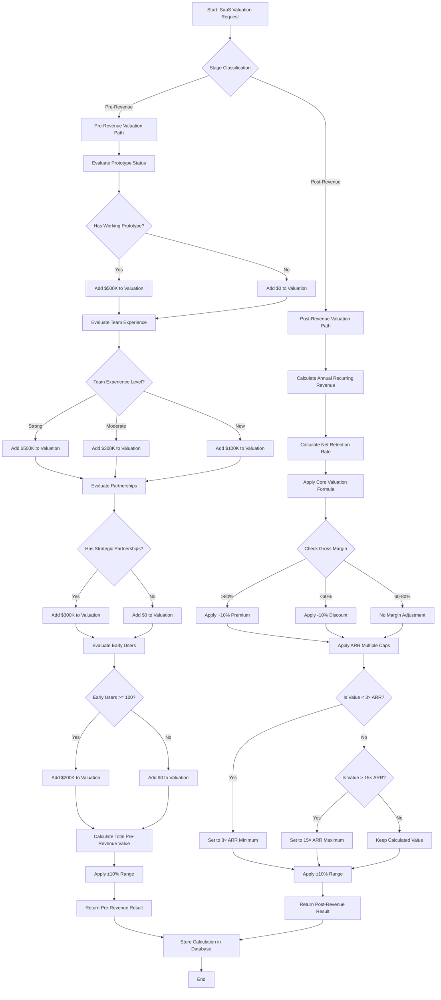
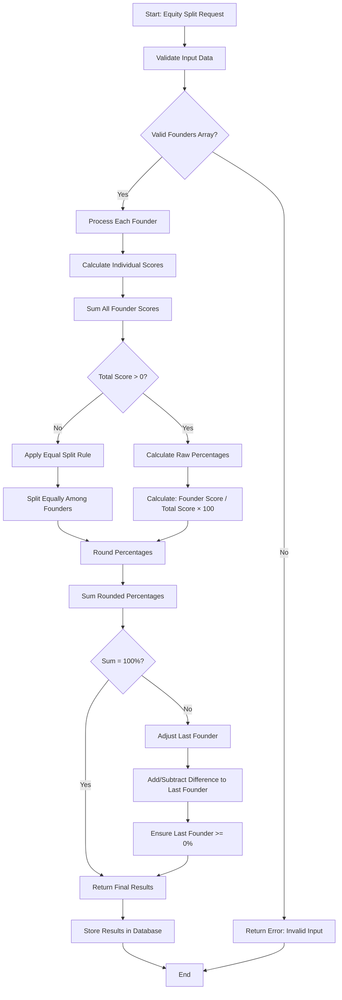
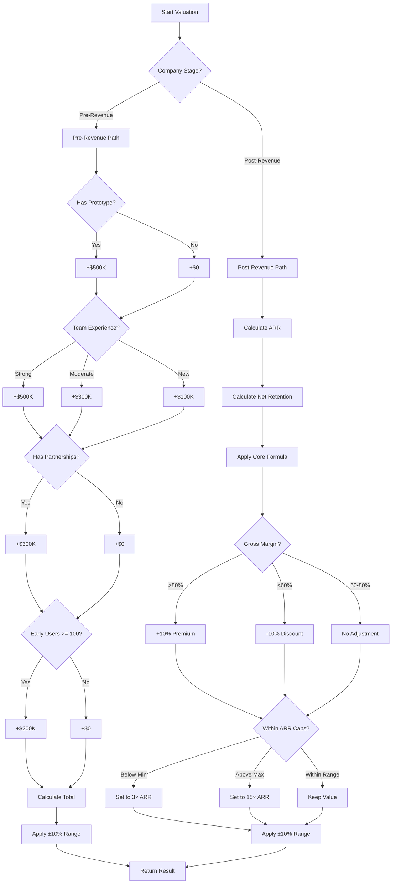
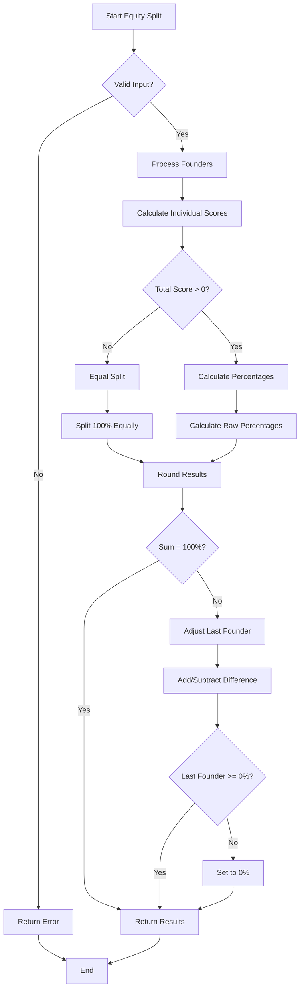

# CapitalReach.ai Tools - Business Logic Documentation

## Table of Contents
1. [SaaS Valuation Calculator Business Logic](#saas-valuation-calculator-business-logic)
2. [Co-Founder Equity Split Tool Business Logic](#co-founder-equity-split-tool-business-logic)
3. [Business Rules & Decision Trees](#business-rules--decision-trees)
4. [Algorithm Specifications](#algorithm-specifications)

---

## SaaS Valuation Calculator Business Logic

### Business Context & Market Assumptions

#### Pre-Revenue Valuation Philosophy
The pre-revenue method is based on the **Berkus Method**, which values early-stage startups based on key milestones rather than revenue. This approach recognizes that early-stage companies create value through development progress, team quality, and market validation.

**Business Assumptions:**
- Prototype development represents $500K in value creation
- Team experience directly correlates with execution capability
- Strategic partnerships indicate market validation
- Early users demonstrate product-market fit potential

#### Post-Revenue Valuation Philosophy
The post-revenue method uses a **revenue multiple approach** that considers growth, retention, and margins. This reflects the SaaS industry's focus on recurring revenue quality and scalability.

**Business Assumptions:**
- Growth rate is the primary driver of valuation
- Customer retention (low churn) indicates product stickiness
- High gross margins indicate scalability and efficiency
- ARR multiples range from 3x to 15x based on market conditions

### Decision Logic Flowchart



### Business Rules & Decision Criteria

#### Pre-Revenue Valuation Rules

**Rule 1: Prototype Valuation**
```
IF has_prototype = true THEN
    prototype_value = $500,000
ELSE
    prototype_value = $0
END IF
```

**Rule 2: Team Experience Valuation**
```
SWITCH team_experience:
    CASE "strong": team_value = $500,000
    CASE "moderate": team_value = $300,000
    CASE "new": team_value = $100,000
    DEFAULT: team_value = $100,000
END SWITCH
```

**Rule 3: Partnership Valuation**
```
IF has_partnerships = true THEN
    partnership_value = $300,000
ELSE
    partnership_value = $0
END IF
```

**Rule 4: Early Users Valuation**
```
IF early_users >= 100 THEN
    users_value = $200,000
ELSE
    users_value = $0
END IF
```

**Rule 5: Total Pre-Revenue Calculation**
```
total_valuation = prototype_value + team_value + partnership_value + users_value
valuation_range = [total_valuation * 0.9, total_valuation * 1.1]
```

#### Post-Revenue Valuation Rules

**Rule 6: ARR Calculation**
```
ARR = MRR × 12
```

**Rule 7: Net Retention Rate**
```
net_retention_rate = 1 - churn_rate
```

**Rule 8: Core Valuation Formula**
```
base_valuation = ARR × growth_rate × net_retention_rate × 10
```

**Rule 9: Gross Margin Adjustment**
```
IF gross_margin > 80 THEN
    margin_multiplier = 1.1
ELSE IF gross_margin < 60 THEN
    margin_multiplier = 0.9
ELSE
    margin_multiplier = 1.0
END IF

adjusted_valuation = base_valuation × margin_multiplier
```

**Rule 10: ARR Multiple Caps**
```
min_valuation = ARR × 3
max_valuation = ARR × 15

IF adjusted_valuation < min_valuation THEN
    final_valuation = min_valuation
ELSE IF adjusted_valuation > max_valuation THEN
    final_valuation = max_valuation
ELSE
    final_valuation = adjusted_valuation
END IF
```

**Rule 11: Range Calculation**
```
valuation_range = [final_valuation * 0.9, final_valuation * 1.1]
```

---

## Co-Founder Equity Split Tool Business Logic

### Business Context & Fairness Principles

#### Contribution-Based Equity Philosophy
The equity split tool is based on the principle that equity should reflect each founder's contribution to the company's success. This approach ensures fairness and aligns incentives with actual value creation.

**Business Assumptions:**
- All contribution categories are equally weighted
- Time commitment is a critical factor in early-stage companies
- Technical and business contributions have equal value
- Fair distribution prevents future conflicts

#### Scoring Philosophy
The 0-5 scoring system allows for granular assessment while maintaining simplicity. Each point represents approximately 20% of maximum contribution in that category.

### Decision Logic Flowchart



### Business Rules & Decision Criteria

#### Input Validation Rules

**Rule 1: Founders Array Validation**
```
IF founders_array IS NULL OR founders_array.length = 0 THEN
    RETURN ERROR: "founders must be a non-empty array"
END IF
```

**Rule 2: Individual Founder Validation**
```
FOR EACH founder IN founders_array:
    IF founder.scores IS NULL THEN
        founder.scores = default_scores
    END IF
    
    FOR EACH category IN founder.scores:
        IF category_score IS NULL OR NOT_NUMBER THEN
            category_score = 0
        END IF
        
        IF category_score < 0 THEN
            category_score = 0
        END IF
        
        IF category_score > 5 THEN
            category_score = 5
        END IF
    END FOR
END FOR
```

#### Scoring Rules

**Rule 3: Individual Score Calculation**
```
FOR EACH founder:
    total_score = idea_score + product_dev_score + marketing_score + operations_score + time_commitment_score
END FOR
```

**Rule 4: Total Score Validation**
```
total_all_scores = SUM(all_founder_scores)

IF total_all_scores <= 0 THEN
    RETURN equal_split_among_founders
END IF
```

#### Percentage Calculation Rules

**Rule 5: Raw Percentage Calculation**
```
FOR EACH founder:
    raw_percentage = (founder.total_score / total_all_scores) × 100
END FOR
```

**Rule 6: Rounding and Adjustment**
```
// Initial rounding
FOR EACH founder:
    rounded_percentage = ROUND(raw_percentage)
END FOR

// Calculate difference
sum_rounded = SUM(all_rounded_percentages)
difference = 100 - sum_rounded

// Adjust last founder
IF difference != 0 THEN
    last_founder.rounded_percentage += difference
    IF last_founder.rounded_percentage < 0 THEN
        last_founder.rounded_percentage = 0
    END IF
END IF
```

#### Scoring Guidelines Business Rules

**Rule 7: Idea Contribution Scoring**
```
IF original_concept_creator THEN score = 5
ELSE IF major_contributor_to_concept THEN score = 4
ELSE IF significant_input_to_refinement THEN score = 3
ELSE IF minor_contributions THEN score = 2
ELSE IF limited_input THEN score = 1
ELSE score = 0
END IF
```

**Rule 8: Product Development Scoring**
```
IF lead_developer_or_architect THEN score = 5
ELSE IF major_technical_contributor THEN score = 4
ELSE IF significant_development_work THEN score = 3
ELSE IF some_technical_contributions THEN score = 2
ELSE IF limited_technical_input THEN score = 1
ELSE score = 0
END IF
```

**Rule 9: Marketing Scoring**
```
IF lead_marketing_strategy THEN score = 5
ELSE IF major_marketing_campaigns THEN score = 4
ELSE IF significant_marketing_contributions THEN score = 3
ELSE IF some_marketing_support THEN score = 2
ELSE IF limited_marketing_input THEN score = 1
ELSE score = 0
END IF
```

**Rule 10: Operations Scoring**
```
IF lead_operations_legal_finance_hr THEN score = 5
ELSE IF major_operational_responsibilities THEN score = 4
ELSE IF significant_operational_work THEN score = 3
ELSE IF some_operational_support THEN score = 2
ELSE IF limited_operational_input THEN score = 1
ELSE score = 0
END IF
```

**Rule 11: Time Commitment Scoring**
```
IF full_time_from_day_one THEN score = 5
ELSE IF full_time_with_some_breaks THEN score = 4
ELSE IF mostly_full_time THEN score = 3
ELSE IF part_time_significant_involvement THEN score = 2
ELSE IF part_time_limited_involvement THEN score = 1
ELSE score = 0
END IF
```

---

## Business Rules & Decision Trees

### SaaS Valuation Decision Tree



### Equity Split Decision Tree



---

## Algorithm Specifications

### SaaS Valuation Algorithm

#### Pre-Revenue Algorithm
```pseudocode
FUNCTION calculatePreRevenueValuation(inputs):
    valuation = 0
    
    // Prototype factor
    IF inputs.has_prototype THEN
        valuation += 500000
    END IF
    
    // Team experience factor
    SWITCH inputs.team_experience:
        CASE "strong": valuation += 500000
        CASE "moderate": valuation += 300000
        CASE "new": valuation += 100000
    END SWITCH
    
    // Partnerships factor
    IF inputs.has_partnerships THEN
        valuation += 300000
    END IF
    
    // Early users factor
    IF inputs.early_users >= 100 THEN
        valuation += 200000
    END IF
    
    // Calculate range
    range_delta = ROUND(valuation * 0.1)
    min_range = MAX(0, valuation - range_delta)
    max_range = valuation + range_delta
    
    RETURN {
        valuation_estimate: ROUND(valuation),
        valuation_range: [min_range, max_range],
        method: "berkus_pre_revenue",
        notes: "Berkus-style factor scoring"
    }
END FUNCTION
```

#### Post-Revenue Algorithm
```pseudocode
FUNCTION calculatePostRevenueValuation(inputs):
    // Calculate ARR
    ARR = inputs.mrr * 12
    
    // Calculate net retention
    net_retention = 1 - inputs.churn_rate
    
    // Core valuation formula
    base_valuation = ARR * inputs.growth_rate * net_retention * 10
    
    // Apply margin adjustment
    IF inputs.gross_margin > 80 THEN
        margin_multiplier = 1.1
    ELSE IF inputs.gross_margin < 60 THEN
        margin_multiplier = 0.9
    ELSE
        margin_multiplier = 1.0
    END IF
    
    adjusted_valuation = base_valuation * margin_multiplier
    
    // Apply ARR caps
    min_cap = ARR * 3
    max_cap = ARR * 15
    
    final_valuation = CLAMP(adjusted_valuation, min_cap, max_cap)
    
    // Calculate range
    range_delta = ROUND(final_valuation * 0.1)
    min_range = final_valuation - range_delta
    max_range = final_valuation + range_delta
    
    RETURN {
        valuation_estimate: ROUND(final_valuation),
        valuation_range: [min_range, max_range],
        method: "revenue_multiple",
        notes: "ARR × growth × retention × 10 with margin adjustment"
    }
END FUNCTION
```

### Equity Split Algorithm

```pseudocode
FUNCTION calculateEquitySplit(founders):
    // Validate input
    IF founders.length = 0 THEN
        RETURN ERROR: "founders must be a non-empty array"
    END IF
    
    // Calculate total scores
    total_score = 0
    founder_scores = []
    
    FOR EACH founder IN founders:
        score = SUM(founder.scores.values)
        founder_scores.push({
            name: founder.name || "Founder",
            score: score
        })
        total_score += score
    END FOR
    
    // Handle zero total score
    IF total_score <= 0 THEN
        equal_share = 100 / founders.length
        RETURN founders.map(f => ({
            name: f.name || "Founder",
            share_percent: ROUND(equal_share)
        }))
    END IF
    
    // Calculate raw percentages
    raw_percentages = []
    FOR EACH founder IN founder_scores:
        raw_percentage = (founder.score / total_score) * 100
        raw_percentages.push({
            name: founder.name,
            raw_percentage: raw_percentage
        })
    END FOR
    
    // Round percentages
    rounded_percentages = []
    sum_rounded = 0
    
    FOR EACH founder IN raw_percentages:
        rounded = ROUND(founder.raw_percentage)
        rounded_percentages.push({
            name: founder.name,
            share_percent: rounded
        })
        sum_rounded += rounded
    END FOR
    
    // Adjust to ensure 100%
    difference = 100 - sum_rounded
    IF difference != 0 THEN
        last_founder = rounded_percentages[rounded_percentages.length - 1]
        last_founder.share_percent += difference
        last_founder.share_percent = MAX(0, last_founder.share_percent)
    END IF
    
    RETURN rounded_percentages
END FUNCTION
```

---

## Business Logic Validation Rules

### Input Validation
- All numeric inputs must be non-negative
- Percentages must be between 0-100
- Founder scores must be between 0-5
- Required fields must be present

### Output Validation
- Valuation estimates must be positive numbers
- Equity percentages must sum to exactly 100%
- All percentages must be non-negative
- Ranges must be logical (min < max)

### Business Rule Compliance
- Pre-revenue valuations follow Berkus Method principles
- Post-revenue valuations respect market multiple ranges
- Equity splits ensure fair contribution-based distribution
- All calculations maintain mathematical consistency

---

*This business logic documentation defines the core decision-making processes and algorithms used in both tools. Any changes to the business rules should be reflected in this documentation.*
