# CapitalReach.ai Tools Documentation

## Table of Contents

1. [SaaS Valuation Calculator](#saas-valuation-calculator)
2. [Co-Founder Equity Split Tool](#co-founder-equity-split-tool)

---

## SaaS Valuation Calculator

### Overview

The SaaS Valuation Calculator helps startups estimate their company's worth using two different methodologies based on their stage: pre-revenue or post-revenue.

### How It Works

#### 🚀 Pre-Revenue Method (Berkus Model)

For startups without revenue, the calculator uses a factor-based scoring system inspired by the Berkus Method.

**Valuation Factors:**

- **Prototype**: +$500,000 (if you have a working prototype)
- **Team Experience**:
  - Strong: +$500,000
  - Moderate: +$300,000
  - New: +$100,000
- **Partnerships**: +$300,000 (if you have strategic partnerships)
- **Early Users**: +$200,000 (if you have 100+ early users)

**Example Calculation:**

```
Startup with:
✓ Prototype: +$500,000
✓ Strong team: +$500,000
✓ Partnerships: +$300,000
✓ 150 early users: +$200,000

Total Valuation = $1,500,000
Range: $1,350,000 - $1,650,000 (±10%)
```

#### 💰 Post-Revenue Method (Revenue Multiple)

For startups with revenue, the calculator uses a revenue-based formula that considers growth, retention, and margins.

**Core Formula:**

```
Valuation = ARR × Growth Rate × Net Retention Rate × 10
```

**Where:**

- **ARR** = Monthly Recurring Revenue × 12
- **Growth Rate** = Monthly growth rate (e.g., 0.15 = 15%)
- **Net Retention Rate** = 1 - Churn Rate (e.g., 1 - 0.03 = 0.97)

**Gross Margin Adjustments:**

- High margin (>80%): +10% to valuation
- Low margin (<60%): -10% to valuation

**Caps Applied:**

- Minimum: 3× ARR
- Maximum: 15× ARR

**Example Calculation:**

```
Inputs:
- MRR: $10,000
- Growth: 15% monthly (0.15)
- Churn: 3% monthly (0.03)
- Gross Margin: 85%

Calculation:
ARR = $10,000 × 12 = $120,000
Net Retention = 1 - 0.03 = 0.97
Base Valuation = $120,000 × 0.15 × 0.97 × 10 = $174,600
Margin Adjustment: +10% (85% > 80%)
Final Valuation = $174,600 × 1.1 = $192,060

Range: $172,854 - $211,266 (±10%)
```

### Flowchart: SaaS Valuation Process

```mermaid
flowchart TD
    A[Start] --> B{Stage Selection}
    B -->|Pre-Revenue| C[Pre-Revenue Calculation]
    B -->|Post-Revenue| D[Post-Revenue Calculation]

    C --> C1[Check Prototype]
    C1 --> C2[Add Team Experience Score]
    C2 --> C3[Add Partnerships Score]
    C3 --> C4[Add Early Users Score]
    C4 --> C5[Calculate Total]
    C5 --> C6[Apply ±10% Range]
    C6 --> E[Return Result]

    D --> D1[Calculate ARR]
    D1 --> D2[Calculate Net Retention]
    D2 --> D3[Apply Core Formula]
    D3 --> D4{Check Gross Margin}
    D4 -->|>80%| D5[+10% Adjustment]
    D4 -->|<60%| D6[-10% Adjustment]
    D4 -->|60-80%| D7[No Adjustment]
    D5 --> D8[Apply ARR Caps]
    D6 --> D8
    D7 --> D8
    D8 --> D9[Apply ±10% Range]
    D9 --> E

    E --> F[Store in Database]
    F --> G[End]
```



### Input Fields

#### Pre-Revenue Fields:

- **Has Prototype**: Boolean (Yes/No)
- **Team Experience**: Dropdown (Strong/Moderate/New)
- **Has Partnerships**: Boolean (Yes/No)
- **Early Users**: Number (optional)

#### Post-Revenue Fields:

- **MRR**: Monthly Recurring Revenue in USD
- **Growth Rate**: Monthly growth rate as decimal (e.g., 0.15 for 15%)
- **Churn Rate**: Monthly churn rate as decimal (e.g., 0.03 for 3%)
- **Gross Margin**: Percentage (0-100, optional)

### Output

- **Valuation Estimate**: The calculated value in USD
- **Valuation Range**: ±10% of the estimate
- **Method Used**: Which calculation approach was applied
- **Notes**: Explanation of the factors considered

---

## Co-Founder Equity Split Tool

### Overview

The Co-Founder Equity Split Tool helps distribute equity fairly among co-founders based on their contributions across multiple categories.

### How It Works

#### Contribution Categories

Each founder is scored (0-5) across five key areas:

1. **Idea** (0-5 points): Who came up with the original concept
2. **Product Development** (0-5 points): Technical implementation and product building
3. **Marketing** (0-5 points): Brand, customer acquisition, and growth
4. **Operations** (0-5 points): Business operations, legal, finance, HR
5. **Time Commitment** (0-5 points): Full-time vs part-time involvement

#### Calculation Process

**Step 1: Score Each Founder**

```
Founder A:
- Idea: 5 points
- Product Dev: 4 points
- Marketing: 2 points
- Operations: 3 points
- Time Commitment: 5 points
Total: 19 points

Founder B:
- Idea: 2 points
- Product Dev: 5 points
- Marketing: 4 points
- Operations: 2 points
- Time Commitment: 4 points
Total: 17 points
```

**Step 2: Normalize to 100%**

```
Total Points: 19 + 17 = 36
Founder A: (19/36) × 100 = 52.78% → 53%
Founder B: (17/36) × 100 = 47.22% → 47%
```

**Step 3: Ensure Sum Equals 100%**
If rounding doesn't equal 100%, the last founder's percentage is adjusted:

```
Founder A: 53%
Founder B: 47%
Total: 100% ✓
```

### Flowchart: Equity Split Process


### Scoring Guidelines

#### Idea (0-5 points)

- **5**: Original concept creator, unique insight
- **4**: Major contributor to concept development
- **3**: Significant input to idea refinement
- **2**: Minor contributions to concept
- **1**: Limited input
- **0**: No contribution

#### Product Development (0-5 points)

- **5**: Lead developer, architect, or technical founder
- **4**: Major technical contributor
- **3**: Significant development work
- **2**: Some technical contributions
- **1**: Limited technical input
- **0**: No technical contribution

#### Marketing (0-5 points)

- **5**: Lead marketing strategy, brand development
- **4**: Major marketing campaigns, customer acquisition
- **3**: Significant marketing contributions
- **2**: Some marketing support
- **1**: Limited marketing input
- **0**: No marketing contribution

#### Operations (0-5 points)

- **5**: Lead operations, legal, finance, HR
- **4**: Major operational responsibilities
- **3**: Significant operational work
- **2**: Some operational support
- **1**: Limited operational input
- **0**: No operational contribution

#### Time Commitment (0-5 points)

- **5**: Full-time from day one
- **4**: Full-time with some breaks
- **3**: Mostly full-time
- **2**: Part-time significant involvement
- **1**: Part-time limited involvement
- **0**: No time commitment

### Example Calculation

**Scenario**: Two co-founders starting a SaaS company

**Founder Alice:**

- Idea: 5 (original concept)
- Product Dev: 4 (lead developer)
- Marketing: 2 (some input)
- Operations: 3 (handles legal/finance)
- Time Commitment: 5 (full-time)
- **Total: 19 points**

**Founder Bob:**

- Idea: 2 (helped refine concept)
- Product Dev: 5 (co-developer)
- Marketing: 4 (lead marketing)
- Operations: 2 (some support)
- Time Commitment: 4 (full-time)
- **Total: 17 points**

**Calculation:**

```
Total Points: 19 + 17 = 36
Alice: (19/36) × 100 = 52.78% → 53%
Bob: (17/36) × 100 = 47.22% → 47%

Final Split: Alice 53%, Bob 47%
```

### Input Fields

- **Founder Names**: Text input for each founder
- **Contribution Scores**: 0-5 scale for each category per founder
- **Add/Remove Founders**: Dynamic founder management

### Output

- **Equity Split**: Percentage allocation for each founder
- **Method Used**: Contribution score normalization
- **Notes**: Explanation of the calculation process

### Best Practices

#### For SaaS Valuation:

1. **Be Honest**: Use realistic numbers for growth and churn
2. **Consider Market**: Adjust expectations based on your industry
3. **Regular Updates**: Recalculate as your metrics change
4. **Multiple Scenarios**: Test different growth assumptions

#### For Equity Split:

1. **Be Objective**: Score contributions honestly
2. **Discuss Together**: All founders should agree on scores
3. **Document Decisions**: Keep records of how scores were determined
4. **Future Considerations**: Plan for future contributions and vesting
5. **Legal Review**: Have final agreements reviewed by legal counsel

### Technical Implementation

Both tools:

- Store calculations in `tool_calculations` database table
- Include user email for result tracking (optional)
- Provide API endpoints via Supabase Edge Functions
- Return structured JSON responses with results and metadata

### Database Schema

```sql
CREATE TABLE tool_calculations (
  id UUID PRIMARY KEY DEFAULT gen_random_uuid(),
  user_email TEXT,
  tool_type TEXT NOT NULL, -- 'saas_valuation' or 'equity_split'
  inputs JSONB NOT NULL,
  results JSONB NOT NULL,
  created_at TIMESTAMP WITH TIME ZONE DEFAULT NOW()
);
```

---

_This documentation is maintained by the CapitalReach.ai team. For questions or suggestions, please contact our support team._
