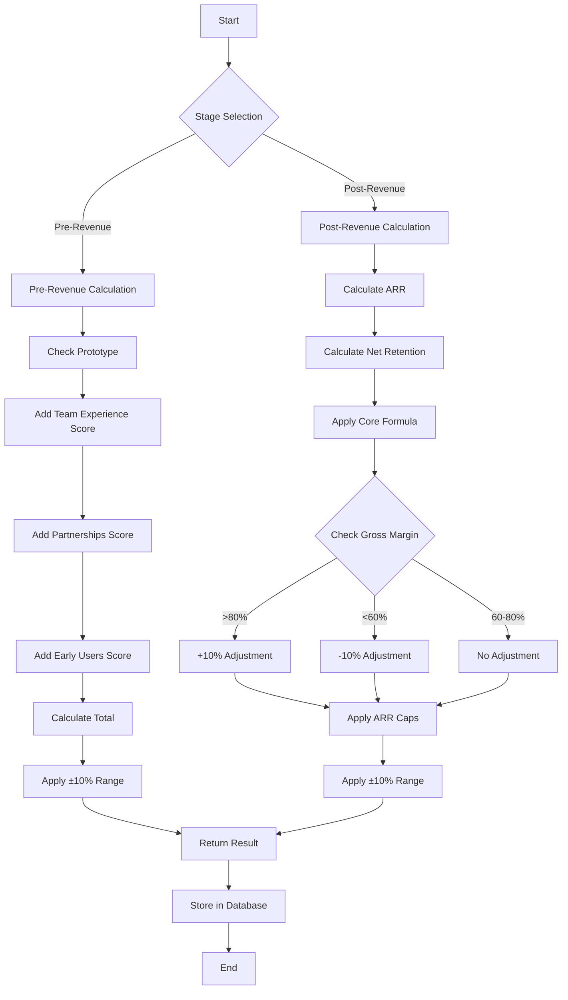
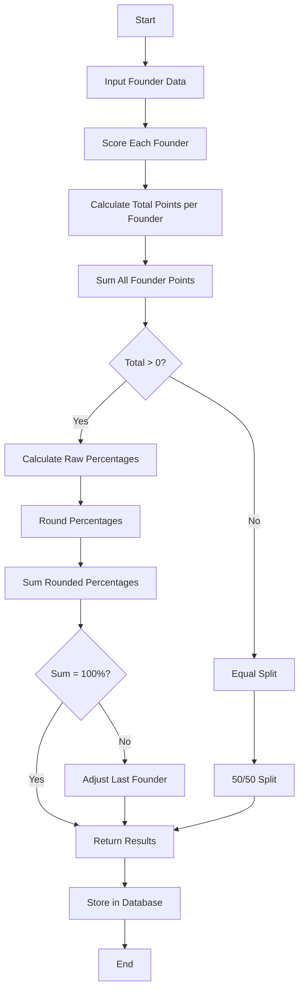

# CapitalReach.ai Tools - Flowcharts

## SaaS Valuation Calculator Flowchart



## Co-Founder Equity Split Flowchart



## Quick Reference: Calculation Methods

### SaaS Valuation - Pre-Revenue

```
Valuation = Sum of Factors:
- Prototype: +$500K (if yes)
- Team Experience: +$100K-$500K
- Partnerships: +$300K (if yes)
- Early Users: +$200K (if >100 users)
```

### SaaS Valuation - Post-Revenue

```
Valuation = ARR × Growth × Net Retention × 10
Where:
- ARR = MRR × 12
- Net Retention = 1 - Churn Rate
- Apply margin adjustments (±10%)
- Cap between 3× and 15× ARR
```

### Equity Split

```
For each founder:
1. Score 0-5 in each category
2. Sum all scores per founder
3. Calculate percentage: (Founder Total / All Totals) × 100
4. Round and ensure sum = 100%
```

---

_These flowcharts visualize the decision logic and calculation processes for both tools._
