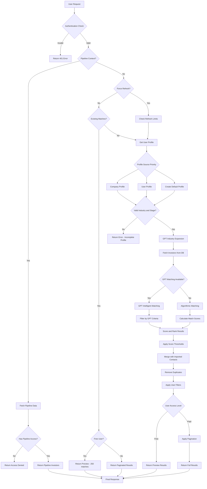
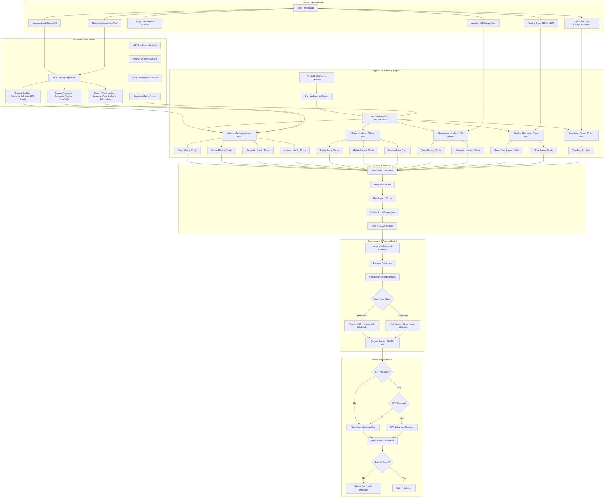

# Investor Matching System - Data Flow Flowchart

## Deep Algorithm Analysis - How Matching Works

### Key Algorithm Details:

**Data Points Collected:**

- Industry (with GPT expansion to related sectors)
- Investment Stage (Pre-seed, Seed, Series-A, etc.)
- Funding Goal (with sweet spot matching)
- Geographic Location (region and preferred locations)
- Business Description (used for AI analysis)
- Investment Type (Equity, Convertible, etc.)

**Matching Process:**

- **Primary Method**: GPT Intelligent Matching (analyzes 20,000 investors)
- **Fallback Method**: Algorithmic scoring system (125 points max)
- **Investor Database**: 20,000 active investors (excludes bounced emails)
- **Score Thresholds**: Minimum 30 points, Maximum 100 points
- **Result Limits**: Up to 11,000 matches, cached up to 25,000

**Fallback Mechanisms:**

- GPT failure → Algorithmic matching
- Missing profile → Default SaaS + Seed profile
- No results → Return empty with helpful message
- Database error → Return cached data
- Invalid profile → Return error with guidance
