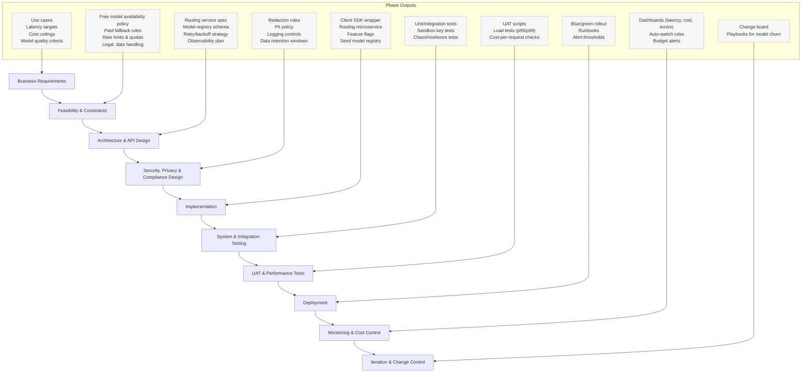
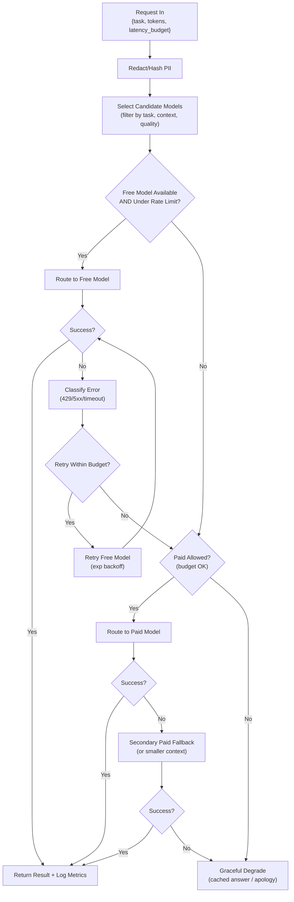

# OpenRouter LLM Integration — Waterfall & Runtime Routing

A ready-to-drop **Markdown spec** for integrating OpenRouter models (incl. “free” options) with **fallbacks to paid** models, plus security, budgets, and monitoring.

---

## Table of Contents

1. [Project Waterfall](#project-waterfall)  
2. [Runtime Routing Flow](#runtime-routing-flow)  
3. [Key Decisions & Config](#key-decisions--config)  
4. [Monitoring & Cost Control](#monitoring--cost-control)  
5. [Security & Compliance](#security--compliance)  
6. [Rollout & Change Management](#rollout--change-management)  
7. [Quick Start: Minimal Client Call](#quick-start-minimal-client-call)

---

## Project Waterfall



---

## Runtime Routing Flow



**Runtime rules:**
- **Model registry** drives selection: `{name, price, context_window, speed_tier, quality_tags, availability, vendor}`  
- **Privacy guard** runs before routing (mask emails, IDs, secrets).  
- **Rate limits**: per-user, per-org, per-model; exponential backoff on 429.  
- **Budgets**: deny paid path if cap would be exceeded.  
- **Graceful degrade**: cached summary/template or reduced context attempt.

---

## Key Decisions & Config

### Model Registry (example JSON)

```json
{
  "models": [
    {
      "name": "free/gen-quick",
      "vendor": "openrouter",
      "price": 0,
      "context_window": 16384,
      "speed_tier": "standard",
      "quality_tags": ["general", "drafting"],
      "availability": "healthy",
      "routing_weight": 1.0
    },
    {
      "name": "paid/premium-32k",
      "vendor": "openrouter",
      "price": 0.0005,
      "context_window": 32768,
      "speed_tier": "fast",
      "quality_tags": ["reasoning", "long"],
      "availability": "healthy",
      "routing_weight": 1.0
    }
  ],
  "policies": {
    "free_first": true,
    "max_retries_free": 1,
    "retry_backoff_ms": [500, 1500],
    "fallback_to_paid": true,
    "deny_paid_if_budget_exceeded": true
  }
}
```

### Routing Policy (pseudocode)

```pseudo
fn route(request):
  sanitized = privacy_guard.redact(request)
  candidates = registry.filter_by_task(sanitized.task)
                      .filter_by_tokens(sanitized.max_tokens)
                      .sort_by(price_then_quality)

  if policies.free_first:
    free = candidates.first(model.price == 0 && under_rate_limit(model))
    if free:
      result = try_with_retries(free, sanitized, policies.max_retries_free)
      if result.ok:
        return result
      // else fall through to paid

  if policies.fallback_to_paid && budget.ok(request.org):
    paid = candidates.first(model.price > 0 && under_rate_limit(model))
    result = try_with_retries(paid, sanitized, 1)
    if result.ok:
      return result

  return graceful_degrade(sanitized)
```

### Rate Limits & Quotas
- **Buckets:** `per-user`, `per-org`, `per-model`.
- **Defaults:** 60 rpm/user on free; 120 rpm/org on paid (tune to your traffic).
- **Backoff:** 0.5s → 1.5s; jitter ±20%.

---

## Monitoring & Cost Control

- **Metrics per call:** `{model, route("free"/"paid"), latency_ms, input_tokens, output_tokens, cost_usd, error_class}`  
- **Dashboards:** p50/p95/p99 latency; success rate; % free usage; $/1k requests; budget headroom.  
- **Alerts:**  
  - Error rate > 5% over 5 min  
  - p95 latency > target for 10 min  
  - Monthly spend > 80% of cap  
- **Auto-switch:** if free model unhealthy for 3 consecutive checks, temporarily bypass free path.

---

## Security & Compliance

- **Prompt redaction**: mask emails, phone, access tokens, IDs.  
- **No raw logs**: store hashes; enable “privacy mode” for sensitive domains.  
- **Retention**: rotate logs & tokenized prompts (e.g., 30–90 days).  
- **Secrets**: keep OpenRouter key server-side only; per-env keys.  
- **Allow/deny lists**: restrict models by tenant if needed.

---

## Rollout & Change Management

- **Blue/green** deployment for the routing service.  
- **Feature flags**: `use_free_models`, `force_paid`, `max_tokens_cap`.  
- **Canary**: start with 5% traffic; observe metrics; then ramp.  
- **Playbooks**: model EOL, vendor outage, budget exceeded, token inflation.

---

## Quick Start: Minimal Client Call

> Replace the model name with one from your registry. Keep your API key **server-side**.

```ts
// TypeScript (Next.js API route or server action)
export async function callModel(messages: {role: string; content: string}[]) {
  const res = await fetch("https://openrouter.ai/api/v1/chat/completions", {
    method: "POST",
    headers: {
      "Content-Type": "application/json",
      // NEVER expose this in the browser:
      "Authorization": `Bearer ${process.env.OPENROUTER_API_KEY}`,
      // Optional: identify your app
      "HTTP-Referer": "https://your-app.com",
      "X-Title": "Your App Name"
    },
    body: JSON.stringify({
      model: "free/gen-quick",   // or your paid fallback
      messages,
      max_tokens: 512,
      temperature: 0.7
    })
  });

  if (!res.ok) throw new Error(`OpenRouter error: ${res.status}`);
  const data = await res.json();
  return data.choices?.[0]?.message?.content ?? "";
}
```

---

**Save as:** `openrouter-integration-flow.md`
